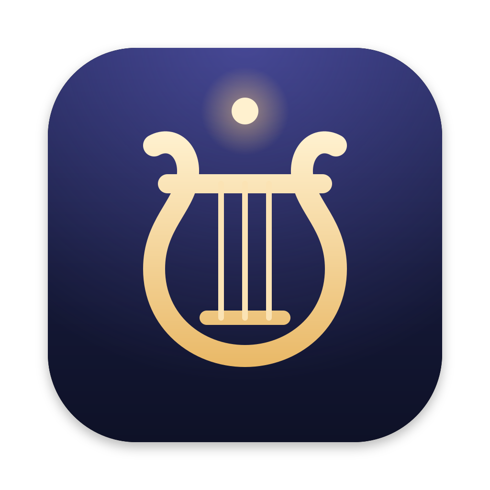

<p align="center">
  
</p>

<h1 align="center">Lyra</h1>

<p align="center">
  A native Mac notes app for a folder of Markdown.<br>
  Write in Source, review in Reading, keep plain files on disk.
</p>

<p align="center">
  <a href="https://github.com/jackspiering/Lyra/releases/latest"></a>
  <a href="https://github.com/jackspiering/Lyra/actions/workflows/ci.yml"></a>
  
  <a href="LICENSE"></a>
</p>

Lyra is for people leaving Obsidian or other Electron apps who still want a folder of notes. A vault is a folder on your Mac, and every note is a UTF-8 Markdown file that Git, Finder, and other editors can read. No database, no account, no lock-in.

## Install

Download the [latest release](https://github.com/jackspiering/Lyra/releases/latest) and drag Lyra to Applications. Requires macOS 15 or later.

The DMG is ad-hoc signed, not notarized. If macOS blocks the first launch, open **System Settings → Privacy & Security** and click **Open Anyway**. Each release lists the DMG's SHA-256.

## Features

- **Source and Reading.** Edit plain Markdown with quiet syntax styling, then switch to a rendered, read-only view with ⌘E.
- **Wiki links and backlinks.** `[[Note]]`, `[[Folder/Note]]`, `[[Note|alias]]`, and YAML `aliases:`. Ambiguous links ask instead of guessing, and a backlinks pane shows who links here.
- **Go to File and Search.** ⌘O finds a note by name; ⇧⌘F searches every note body.
- **Tabs and windows.** Several notes per window, one vault per window. Each window reopens its vault after a relaunch.
- **The filename is the title.** Rename a note from its title, and Lyra offers to update the links to it.
- **Careful with your files.** Autosave, external-edit detection, and saves that keep creation dates, permissions, and Finder tags.
- **Image paste and PDF export.** Pasted images go to `_attachments/` with a relative link. Export the open note as a PDF.
- **Night and Parchment.** Dark and light looks that follow the system, with Liquid Glass on macOS 26.

## Keyboard shortcuts

| Shortcut | Action |
| --- | --- |
| ⌘N | New note |
| ⌘O | Go to File (Open Vault when no vault is open) |
| ⌘F / ⇧⌘F | Find in note / Search the vault |
| ⌘E | Toggle Source and Reading |
| ⌘T / ⇧⌘W | New tab / Close tab |
| ⇧⌘N | New vault window |
| ⌘S | Save now (autosave runs after a short pause) |
| ⌘R | Refresh the vault from disk |
| ⌘+ / ⌘− / ⌘0 | Zoom the editor |
| ⌘⌫ | Move the sidebar selection to the Trash |

## Your vault

```text
My Vault/
├── Welcome.md
├── Projects/
│   └── Roadmap.md
└── _attachments/
    └── pasted-image-20260807-120000.png
```

Lyra lists visible `.md` files and ignores hidden files, packages, and symlinks. It writes nothing to the folder except your notes and pasted images.

**Not planned:** plugins, graph view, sync or accounts, tags, daily notes, embeds, WYSIWYG, iOS.

## Build from source

You need Xcode 26 on a Mac.

```bash
git clone https://github.com/jackspiering/Lyra.git
open Lyra/Lyra.xcodeproj   # run the Lyra scheme on My Mac
```

Read [CONTRIBUTING.md](CONTRIBUTING.md) before opening a pull request. Design decisions are in [docs/architecture.md](docs/architecture.md), CI and releases in [docs/ci.md](docs/ci.md).

## License

[MIT](LICENSE) © 2026 Jack Spiering. Lyra bundles [Inter](https://rsms.me/inter/) under the SIL Open Font License ([`Inter-OFL.txt`](Lyra/Resources/Fonts/Inter-OFL.txt)).
